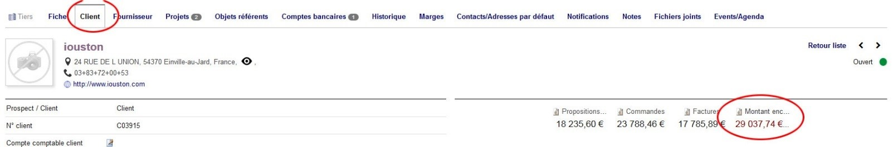

 # Clients, contact, etc...

## Créer un client 

<!-- tabs:start -->

#### ** En mode semi-automatique **

Depuis le menu horizontal haut, aller sur 'Tiers'
* Cliquez sur 'Nouveau tiers'
* En passant par ce cheminement, vous accédez à une interface de recherche automatique.
* Indiquez un indice de recherche, par exemple 'Menuiserie Picard' et cliquez sur rechercher.
* Le logiciel interroge alors une base de données externe des entreprises et vous propose une liste de résultats.
* Cocher le ou les résultats correspondants et cliquez sur créer
* Dolibarr créé alors automatiquement la fiche du tiers à partir des informations disponibles.

#### ** En mode manuel **

Depuis le menu horizontal haut, aller sur 'Tiers'
* Cliquer sur 'Nouveau client' (ou 'nouveau prospect' selon le cas)
* Seuls les champs en gras sont obligatoires
* Remplissez la fiche de façon exhaustive. 
* Rappelez-vous que cette fiche servira ensuite à toutes les étapes et à chaque fois que nous travaillerons avec ce client. C'est donc un gain de temps pour l'ensemble des personnes qui auront à travailler avec ces informations si la fiche est correctement renseignée.
* Valider votre fiche en cliquant sur 'Créer tiers'
* Créer ensuite les contacts associés à ce tiers

> [!WARNING]
> Attention, le numéro de Siret est obligatoire pour ajouter un tiers. Il permet de vérifier qu'il n'y a pas de doublon dans la base…(en mode semi automatique, le siret est récupéré automatiquement)

<!-- tabs:end -->

## Créer un client sans numéro de siret

<!-- tabs:start -->

#### ** C'est un client particulier **

* Lorsque vous devez créer un client pour un particulier
* Vous devez ch oisir tout en haut de la fiche création du client "Créer un tiers + un contact/adresse/fils"
* En faisant cela, dolibarr préselectionne le type "particulier" pour le champ type de tiers

> [!NOTE]
> Le numéro de siret n'est alors plus obligatoire, même, si le champ reste en gras.

#### ** C'est un client pro sans numéro de siret **

* Créer un client en mode manuel et sélectionner le type d'entreprise Particulier
* Dans ce cas le numéro de Siret n'est plus obligatoire

> [!DANGER]
> Cette fonction n'est à utiliser que dans le cas de la création d'entreprise

<!-- tabs:end -->

## Créer un contact
* Aller dans la fiche du tiers concerné, ne pas hésiter à utiliser le moteur de recherche situé sur la gauche pour cela.
* Descendre tout en bas de la fiche du tiers.
* Sur la droite, cliquer sur 'Créer contact/adresse'
* Remplir les champs de la fiche de façon exhaustive
* Valider en cliquant sur 'Ajouter'

## Créer un contact par défaut
* Cette fonctionnalité permet de sélectionner par défaut un contact d'une entreprise. Très pratique pour des clients récurrents où pour des clients au fonctionnement complexe (pas le même contact entre le technicien en charge, le donneur d'ordre et le payeur par exemple)
* Depuis la fiche d'un tiers
* Cliquer sur l'onglet "Contact/Adresse par défaut"
* Ajouter les contacts et le type de contact souhaité

## Vérifier l'encours du client
* Pour consulter l'encours du client, il faut se rendre sur le tiers concerné
* Depuis la fiche du tiers, allez dans l'onglet 'client'
* Le montant d'encours est affiché sur la partie droite de la page
* Il est possible d'accéder au détail de l'encours du client en cliquant sur 'Montant encours'
* L'encours est calculé sur le HT des commandes validées et des factures impayées
* L'encours est commun aux entreprises qui disposent du même numéro de SIREN
* Le montant d'encours autorisé (assurance crédit) est défini au niveau de la maison mère

## Paramétrer l'assurance crédit pour maison mère et filiale
* Sur chaque fiche de tiers, il exsite le champ 'Maison Mère'.
* Indiquez dans le champ d'une entreprise filiale le nom de la maison mère
* Vous pouvez relier autant de filiales que vous le souhaitez à une maison mère
* N'indiquez pas de montant d'encours autorisé sur la fiche tiers des filiales
* Indiquez le montant d'encours autorisé pour le groupe au niveau de la maison mère

> [!WARNING]
> Pour fonctionner à partir du siren, il faut que ce champ soit rempli. Mais seul le siret est obligatoire. Par contre comme le siret est composé du siren, il est possible de déduire cette information depuis là.
> Pour cela, un bouton permettant de compléter les siren manquant à partir des siret est disponible dans la configuration du module

## Vérifier l'état des différents encours
* Depuis le menu 'tiers'
* Cliquer sur 'Etat des encours'
* Les agents commerciaux peuvent également accéder à cette fonctionnalité mais n'ont accès qu'à l'encours de leurs clients

## Connaitre la réputation d'un client
* La réputation du client permet de vérifier si le client nous signe plus devis qu'il ne nous en signe pas. 
* Si le client nous signe plus de devis qu'il n'en signe pas, il a bonne réputation, une bulle verte au niveau de la fiche tiers est ajoutée ainsi que sur la fiche du devis
* Si un client nous signe autant de devis qu'il n'en signe pas, il a une réputation moyenne, une bulle orange apparait
* Si le client ne nous signe pas plus de devis qu'il ne nous en signe, il a une mauvaise réputation, une bulle rouge apparait