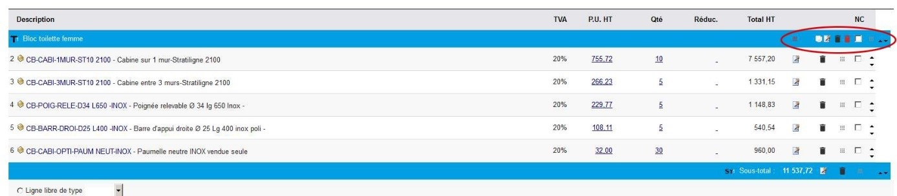
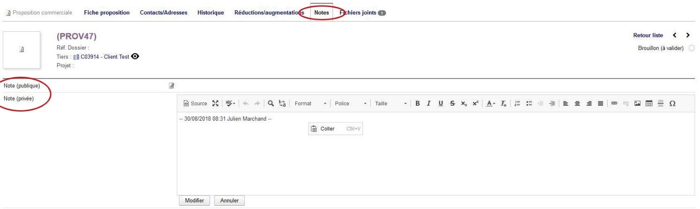
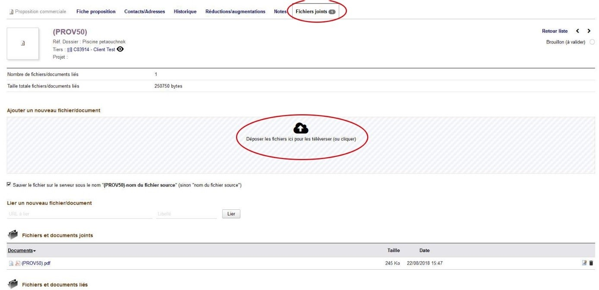

 # Devis
 
## Liste des devis

* Vous pouvez avoir une vue d'ensemble sur tous les devis depuis commercial / liste
* Dans cette liste, vous avez la possibilité de voir sur la droite "l'état" du devis.
* Un devis brouillon est un devis qui est encore en cours de travail. Il ne doit pas être envoyé au client
* Un devis "ouvert" est un devis qui est finalisé et qui a été envoyé au client.
* Un devis "signé" est un devis qui a été validé. L'étape suivante sera de créer une commande
* Un devis "Non signé" est un devis qui a été perdu.
* Options de la vue d'ensemble :
	- La vue d'ensemble des devis permet de rechercher des devis en pariculier grace aux filtres présents en haut de colonne.
	- Vous pouvez également afficher des colonnes supplémentaires en sélectionnant les colonnes souhaitées à partir de l'icone située à droite de l'état.

## Créer un devis

<!-- tabs:start -->

#### ** En passant par le tiers **

En passant par le tiers
* Rendez-vous sur la fiche du client concerné. Si le client n'existe pas encore, créer un client
* Aller dans l'onglet 'Prospect/client'
* En bas à droite, cliquer sur le bouton 'Créer une proposition
* Remplir les champs relatifs au devis
* Créer le brouillon du devis
* Une fois le devis créé, le relier à un projet. Si le projet n'existe pas encore, le créer

> [!WARNING]
> Un devis doit obligatoirement être rattaché à un projet, si ce n'est pas le cas, vous ne pourrez pas valider votre devis.

#### ** En passant par le projet **

* En passant par le projet
* Aller dans le projet concerné par le devis
* Cliquer sur l'onglet 'Vue d'ensemble'
* Dans la section 'Liste des propositions commerciales associées au projet', cliquer sur 'Créer une proposition'
* Indiquer le nom du client destinataire et remplir les champs restants du devis

<!-- tabs:end -->

## Ajouter un produit ou un service au devis

* Selon votre niveau d'autorisation, vous pouvez ajouter des produits prédéfinis et/ou des produits libres. Un produit prédéfini est produit qui a été enregistré au catalogue de LDM Équipement. Son tarif de vente est connu.
* Un produit libre est un produit qui n'est pas disponible dans le catalogue de LDM Équipement. Le prix est à fixer au moment de l'édition du devis. Il est possible de transformer un produit libre en produit prédéfinis en l'ajoutant au catalogue. Seules certaines personnes ont cette autorisation.
* Pour ajouter un produit à votre devis, cliquer dans le champ de formulaire "Produits/Services prédéfinis en vente".
* Indiquer dans ce champ les 3 premières lettres du produit recherché. Il apparait alors une liste des produits correspondants.
* Si vous continuer de saisir les lettres suivantes du produit recherché, la recherche s'affine.
* Vous pouvez également indiquer directement la quantité, la réduction à la ligne sur ce produit et l'emplacement de cette ligne. Par défaut, vous pouvez choisir d'ajouter dans vos localisations ou directement au niveau d'une ligne, à l'aide du champ "position".
* Les numéros de ligne sont situés à gauche de chaque produit du devis et vous permettent de vous repérer rapidement. Ces numéros n'apparaissent pas sur le devis édité.
* Lorsque vous ajouter un produit, il se peut que ce produit compte des produits associés.

## Ajouter un produit associé

* Certains produits disposent de produits associés. Il s'agit de produits à proposer/ajouter au client. Cette fonctionnalité vous permet d'ajouter plusieurs produits complémentaires d'un coup.
* Si la fenêtre modale des produits associés s'affiche, sélectionner un ou plusieurs produits que vous souhaitez ajouter à votre devis.
* Valider votre choix, et les produits cochés seront ajoutés à votre devis

> [!TIP]
> A l'inverse, si vous ne souhaitez pas ajouter des produits complémentaires à votre devis, vous devez malgré tout, cliquer sur le bouton "Valider"

*↑ Ci-dessus la fenêtre modale des produits associés*

## Ajouter une localisation

* Pour ajouter une localisation, cliquer sur le bouton "Ajouter Localisation" situé en bas du devis
* Indiquer le titre de la localisation dans la fenêtre modale qui apparait ainsi que le niveau de la localisation.
* Par défaut, les localisations de niveau 1 apparaissent en bleu. Celles de niveau 2 en rose et les suivantes en bleu. 

> [!WARNING]
> Attention, à ne pas ajouter trop niveau de localisation au risque de perdre le client dans la compréhension du devis. 3 sous niveau semble être le grand maximum…

* Une localisation doit avoir un "total de localisation". De cette façon tout ce qui est ajouté entre le titre et le total de la localisation sera décompté dans le sous total de la localisation.
* Lorsque j'ajoute une nouvelle localisation sans avoir ajouté de "total de localisation" à la précédente localisation, le logiciel ajoute automatiquement le "total de localisation"
* Depuis les icones situées sur la rangée du titre de la localisation vous pouvez déplacer / dupliquer / modifier / supprimer / supprimer avec les lignes contenues la localisation
* Vous pouvez également ajouter une ligne de texte. La ligne de texte permet de préciser un détail lié au produit. La ligne de texte ne comporte pas de prix. La ligne de texte apparait en jaune. Il est possible d'utiliser des textes prédéfinis. Les textes prédéfinis peuvent être ajoutés / modifier / supprimer (en fonction des droits de l'utilisateur) depuis accueil > configuration > dictionnaires > ligne de texte prédéfini.

*↑ Ci-dessus les boutons d'ajout de localisation dans l'écran d'édition du devis
↓ Ci-dessous, les actions propres à la localisation dans l'écran d'édition du devis*

## Modifier rapidement les quantités / les prix

* Lorsque vous avez ajouté des produits, il est possible d'intervenir directement et rapidement sur les valeurs des colonnes : prix / quantité / remise.
* Pour cela, il suffit de cliquer sur le lien bleu et de modifier la valeur.
* Il est possible que vous n'ayez pas les autorisations de modifier rapidement le prix
* Valider votre changement en validant par la touche entrée ou en cliquant en dehors du champ
* Nous attirons votre attention sur le fait qu'il est plus pertinent de réduire le prix via une remise de ligne que directement au niveau du prix car si vous modifiez le prix, le client ne vois pas que vous consentez un effort…

*↑ Ci-dessus Il suffit de cliquer sur les éléments soulignés pour déclencher une action de modification
↓ Ci-dessous, Apès le clic, un champ apparait qu'il vous suffit de modifier et de valider*
 

## Ajouter un produit en négatif

* Lorsque vous éditez un devis, il peut vous arrivez de devoir ajouter un produit en négatif
* C'est par exemple le cas d'un allongement
* Au moment de l'ajout, dolibarr ne tolère pas un produit en négatif
* Il faut donc ajouter votre produit
* L'éditer rapidement, comme vu précédemment en cliquant dessus, et placer le signe – devant la quantité dudit produit.
* Le produit passe alors en négatif, ainsi que le prix associé.

> [!WARNING]
> Attention, dans le cas d'un allongement négatif et afin de calculer une marge juste, il est nécessaire de forcer le prix de revient en négatif également. Sinon la marge finale sera fausse.

## Ajouter une option au devis

* Il est possible d'ajouter des options au devis, c’est-à-dire, indiquer un produit qui n'est pas compté dans le total du devis, mais dont le prix est remplacé par la mention "option"
* Pour cela, modifier un produit en cliquant sur l'icône "Modifier"
* Calculer la valeur totale de l'option et indiquer 0 dans la colonne quantité
* La mention 'option' apparait alors dans la colonne 'Total HT'

> [!WARNING]
> Cela ne fonctionne pas si vous passez par la modification rapide des quantités

## Ajouter un produit offert

* Il est possible d'ajouter un produit offert et de le signaler au client.
* Pour cela, il suffit d'appliquer une remise de 100% 

> [!WARNING]
> Attention il faut passer par l'icone 'modifier' et non pas la modification rapide.

## Produits sans poids

* Si un produit a été référencé sans son poids et que vous l'ajoutez un devis, un pictogramme d'alerte s'affiche à côté du produit concerné. Ce pictogramme vous précise que le poids de ce produit n'est pas connu et que cela pourrait fausser la tarification des frais de port…
* Vous pouvez à tout moment indiquer manuellement le poids total du devis.
* Idéalement, et si vous en avez la permission, aller dans la fiche du produit, et indiquez son poids. Sinon informez votre responsable.
* La page Produits/Services > produits > produits sans poids affiche tous les produits de la base dont le poids n'est pas connu.

## Connaitre le poids total du devis

* Depuis l'écran d'édition du devis, vous pouvez à tout moment connaitre le poids total du devis. Cette information est située à gauche dans les derniers items généraux du devis
* Cette mention n'apparait pas sur le document pdf (notez que ce peut être fait si le besoin est présent)
* Lorsque vous ajoutez un produit, le poids de ce produit est automatiquement ajouté au poids total du devis.
* Si le poids d'un produit n'est pas renseigné, un pictogramme d'alerte apparait et vous indique que le poids de ce produit n'est pas connu.

> [!WARNNG]
> Ce pictogramme doit permettre de corriger cette information dans la base. Il ne devrait donc pas y avoir ce genre de pictogramme dans le logiciel. Rappelez-vous que si cette information manque, les frais de port risquent d'être sous-estimés. 

* Vous pouvez à tout moment corriger le poids total d'un devis en cliquant sur l'icone de modification située à droite du champ : 'Poids total du devis'

## Calculer les frais de port

* Depuis l'écran d'édition des devis, cliquez sur le bouton : 'Frais de port'
* Une fenêtre modale apparait et vous invite à sélectionner la zone de livraison. Par défaut la zone de livraison concerne le département de l'adresse du client concerné.
* Une seconde fenêtre apparait et vous propose le tarif le plus adapté en fonction des transporteurs disponibles.
* Un produit Frais de transport est ajouté au devis avec la valeur correspondante.
* Il s'agit d'un produit lambda, vous pouvez donc, si vous en avez la permission, modifier son tarif, sa quantité, appliquer une réduction, etc…
* Vous pouvez également demander à bénéficier d'un hayon sur le camion de transport. Le montant en sus est autoamtiquement ajouté
> [!WARNING]
> Attention, le calcul du frais de port se fait en fonction des poids de chaque produit et non pas du poids total du devis (qui est là pour information). Il est donc important que le poids de chaque produit référencé dans le logiciel soit connu (cf. produits sans poids) 

## Cloner un devis

* Depuis la page d'édition, le bouton cloner un devis permet de dupliquer un devis, tout en l'affectant au même client ou à un autre client.
* Si la duplication du devis a pour objectif de faire une autre proposition au même client, il est souhaitable de plutôt faire une version de devis
* Le clonage d'un devis est donc intéressant pour proposer rapidement un devis similaire, sur un même chantier à un autre client.
* Pour cela, cliquer sur le bouton "Cloner" et rechercher le nouveau client.
* Valider, puis compléter les champs et le formulaire comme pour un autre devis.

## Valider un devis

* Tant que le devis est en cours d'édition, il est au statut : "Brouillon – à valider"
* Le devis est alors en cours d'édition et ne doit pas être présenté au client. D'ailleurs un filigrane "Brouillon – ne pas diffuser" apparait sur le devis si vous éditez un fichier .pdf
* Tant que le devis est au statut brouillon, il a un numéro provisoire : PROV2587.
* Lorsque vous cliquez sur "Valider", le statut du devis change. Il prend alors un numéro définitif : D201801245 et unique.
* Avant de valider votre devis vous devez vérifier qu'aucune ligne du devis, sur l'écran d'édition, ne comporte un pictogramme d'alerte.
* Si tel est le cas, un message d'avertissement, qui n'empêche pas la validation du devis s'affiche
* Il est possible de modifier un devis validé en cliquant sur le bouton "Modifier"
* Le pdf généré pour un devis validé n'a plus de filigrane

## Archiver – faire une autre version d'un devis

* Lorsque un devis a été validé, de nouveaux boutons apparaissent. Parmi ces boutons, un bouton Archiver.
* Le bouton archiver permet de mettre en mémoire une ou plusieurs versions de devis de façon à proposer une nouvelle version du devis au client.
> [!TIP]
> Grâce à cette fonctionnalité, il ne doit pas y avoir de devis différents, correspondants au même chantier et au même client…
* La version du devis sur laquelle vous travaillez est indiquée dans l'onglet du devis. Ce numéro de version apparait également sur le pdf du devis généré
 
* À tout moment, vous pouvez basculer sur une autre version archivée de votre devis.
* Pour cela, sélectionner la version du devis à visualiser, puis, s'il s'agit bien de la version que vous souhaitez restaurer, cliquez sur "restaurer"

> [!WARNING]
> Attention, lorsque vous restaurer un devis, vous ne retournez pas sur le numéro de devis précédent, vous REMPLACEZ la version courante par la version archivée
> * Par exemple : Je travaille sur la version N°3 d'un devis
> * J'archive cette version (de façon à la conserver), je passe donc sur la version N°4
> * Le client me précise qu'il part finalement sur la version n°2
> * Je sélectionne la version n°2 et après l'avoir visualisé, je la restaure
> * Mon devis est remplacé par les éléments de la version n°2 mais je suis toujours sur la version n°4 du devis.
> * Il faut donc être vigilant, pour ne pas écraser son travail.

## Envoyer par mail un devis

* Une fois le devis édité et conforme, il faut encore le faire parvenir au client
* **Il est désormais obligatoire d'envoyer les devis depuis l'interface de dolibarr**.
* De cette façon, le devis envoyé est intégré automatiquement au suivi de la relation client.
* Cela permet également à une autre personne de l'entreprise d'accéder rapidement à cette information
* Une fois le devis au statut "Validé" le bouton "envoyer par mail apparait.
* Si vous cliquez dessus, un formulaire d'envoi de mail apparait sous le devis
* Le devis au format pdf est automatiquement joint au mail qui sera envoyé
* Vous pouvez choisir un modèle d'email dans le menu déroulant prévu à cet effet.
* Il est possible de personnaliser les modèles de mail depuis : Accueil > configuration > emails > modèle de courriel (selon les permissions que vous avez)
* Vous pouvez personnaliser le contenu du mail et ajouter des fichiers joints, ainsi qu'automatiquement la documentation des produits (à condition que la documentation des produits figure dans les pièces jointes du produit concerné)

## Clôturer un devis

* Pour clôturer un devis, rendez-vous sur la page d'édition du devis concerné.
* Cliquez sur le bouton Accepter/Refuser
* Sous la zone d'édition du devis, positionner le statut du devis à signée (devis gagné) ou non signé (devis perdu).
* La note est une note privée qui permet de préciser un élément de la confirmation : date de la confirmation / mode de confirmation / retenue d'une option / accord de livraion / paiement, etc… toute information qui est à faire suivre dans les étapes suivantes du devis

## Ajouter une note à l'intention des collègues
Les notes ne doivent pas prendre le pas sur la gestion de la relation avec le client. Le but de la note est de préciser un détail sur un élément donné et précis. Le suivi de la relation (cf. Suivi de la relation client) est plus général et doit permettre à un collègue, de connaitre et comprendre qui est ce client, et ce que l'on fait avec lui. C'est une transmission écrite de la mémoire et de la connaissance de notre historique avec le client.
* Il est possible d'ajouter une note à toutes le entités de dolibarr.
* Deux types des notes sont disponibles par défaut : la note privée et la note publique
* La note publique peut potentiellement être affichée à l'extérieur de dolibarr sur un document généré. Il faut donc utiliser cette note avec prudence et ne placer dans cette note que des informations non confidentielles.
* La note privée n'est accessible qu'aux personnes ayant un accès à dolibarr. C'est donc la note privée qu'il faut privilégier pour la transmission d'information entre collègues.
* La note privée peut s'afficher d'elle-même à différentes étapes du process. Par exemple :
* Lors de la validation de son devis par un client, ce dernier m'informe que la commande est à adresser Madame Truc.
* Si je rentre cette information dans la note privée du devis, cette information s'affichera à l'utilisateur lors de la saisie de la commande du client.
 

## Ajouter un post-it à l'écran
* Un type de note 'Post-it' est également disponible sur certains écrans du logiciel
* Une icone 'Post-it' est disponible en haut à droite, à proximité de votre zone de connexion.
* Un clic sur cette icone permet de générer un post-it. Vous pouvez compléter la note et la placer à l'endroit de votre choix sur votre écran.
* La note ne sera visible que sur cet écran.
* Vous pouvez redimensionner la note depuis l'angle droite/bas
* Par défaut, la note (en jaune)  n'est visible que par l'utilisateur qui l'a créée.
* Vous pouvez partager la note à l'ensemble de vos collègues en cliquant sur la clé. La note passe alors en bleue, le post-it apparait pour tous les utilisateurs sur cet élément
* Vous cliquez encore, le post-it est partagée, la note apparait en vert à tous les utilisateurs et sur tous les éléments du même type.
* La note post-it peut être supprimée depuis l'icône de la corbeille (visible lors du survol de la note).
* Les notes de types post-it n'apparaitront pas à d'autres étapes du process (comme dans l'exemple précédemment cité entre un devis et une commande).
 

## Ajouter des pièces jointes
* Depuis l'onglet fichiers joints, vous pouvez ajouter des fichiers au devis en cours
* Il est possible d'ajouter plusieurs fichiers simultanément, directement depuis l'écran, simplement en cliquant/déplaçant les fichiers vers la zone de transfert
* Par défaut dolibarr conserve le nom du fichier. Mais vous pouvez cocher la case "sauver le fichier…" si vous souhaitez que le nom du fichier soit remplacé.
 

## Découper un devis

* Le bouton découper sur l'écran d'édition d'un devis permet de scinder un devis en deux propositions différentes.
* Par le biais de ce bouton, il est également possible de copier certaines lignes d'un devis vers un autre devis
* Il est également possible de sélectionner plusieurs lignes d'un devis en une seule fois.

## Supprimer plusieurs lignes d'un devis

* En cliquant sur le bouton "découper" en bas de la zone d'édition du devis, un formulaire vous permet de sélectionner plusieurs lignes de ce devis
* Vous pouvez alors demander au logiciel de supprimer les lignes sélectionnées

## Afficher / masquer les marges

* Par défaut les marges sur devis sont masquées
* Vous n'avez peut-être pas l'autorisation de les consulter
* Peut être que cet onglet est masqué pour des questions de confidentialité. Par exemple, si vous travaillez sur le devis avec un client.
* L'affichage des marges rend visible un écran général de marge ainsi que 2 colonnes supplémentaires pour chaque ligne du devis.
* Pour afficher les marges d'un devis, cliquer depuis l'écran d'édition d'un devis sur le bouton 'afficher les marges'.
* A l'inverse, cliquer sur le bouton 'cacher les marges' pour faire disparaitre ces éléments.

> [!TIP]Pour rappel :
> * Marge sur le Prix de Revient = Prix de vente - Prix de revient défini sur la fiche produit 
> * Taux de marque = Marge / Prix de vente
> * Si le prix d'achat/revient n'est pas défini dans la fiche du produit alors la marge sera de zéro sur la ligne.

 

## Appliquer une remise ou une augmentation sur le devis

* Vous pouvez, si vos droits utilisateurs vous le permettent appliquer des réductions sur chaque ligne de produit. Si cela est efficace pour des remises au détail, c'est peu pratique pour appliquer une remise globale.
* Il est cependant possible d'appliquer une réduction ou une augmentation de façon globale.
* Pour cela, cliquez depuis la zone d'édition du devis sur le bouton "Réduire/augmenter prix HT"
* Une fenêtre modale apparait alors dans laquelle il vous suffit de préciser le montant à la hausse ou à la baisse du pourcentage global à appliquer.

> [!TIP]
> Attention, il faut placer le signe + ou le signe – devant le pourcentage qui sera appliqué.

* Il est possible d'ajouter successivement plusieurs augmentations et/ou réductions globale sur chaque devis.
À tout moment vous pouvez retrouver les augmentations et réductions qui ont été appliquées sur le devis. Pour cela rendez-vous dans l'onglet "Réductions/augmentations"
* Il est possible de revenir en arrière en supprimant la dernière remise/augmentation appliquée.
* Certains produits sont exclus de la réduction ou de l'augmentation. Comme la pose ou le transport

## Appliquer un prix cible
* Il arrive parfois que le client et vous vous entendiez sur un prix fixe définit, c'est un prix cible
* Dans ce cas, on utilisera également le module de réduction / augmentation
* Par contre on indiquera un montant fixe HT
* Le module calcul alors tout seul le taux de remise à appliquer et conssentir pour obtenir le résultat voulu

> [!TIP]
> Attention, en faisant des prix cibles, parfois le jeu des arrondis fait qu'on arrive pas tout à fait au chiffre voulu.
> Par exemple, je demande 1000€ en prix cible et le module m'affiche un devis à 999,99€ après son calcul
> Dans ce cas là, si je veux obtenir 1000€, je peux supprimer mon prix cible et recommencer en précisant que je souhaite 1000,01€
> Le module refait son calcul, et avec le jeu lié aux arrondis, je vais bien arriver à 1000€

## Gérer les contacts du devis

* Lorsque vous éditez un devis au client, par défaut le devis est édité pour la société, sans indiquer le contact concerné.
* Pour remédier à cela, depuis le devis, cliquer sur l'onglet 'contact/adresse'.
* Sélectionner le contact concerné et le type de contact. En l'occurrence 'contact client suivi proposition'
* Le type de contact permet d'adresser les différents documents à différentes personnes (facture, livraison, etc…)
* Vous devez également paramétrer un contact de 'suivi proposition', généralement, il s'agit de l'agent commercial, et le contact 'etude_proposition'. Normalement ce contact se met automatiquement avec votre nom mais vous pouvez le modifier si nécessaire
* Vous pouvez également définir un contact par défaut au niveau de la fiche du tiers pour ne pas avoir à le faire à chaque fois. (cf. contact par défaut)

## Réaliser un devis, une commande, une facture en autoliquidation de TVA

* Les devis en autoliquidation de TVA sont à réaliser dans le cadre d'une sous traitance dans le cadre d'un marché
* Il suffit de cocher la case 'Autoliquidation TVA' sur l'écran du devis ou l'écran de la commande pour l'utiliser.
* Si cette option est cochée, le devis ou la commande générée n'afficheront pas de TVA et une phrase qui précise le régime de l'autoliquidation de TVA sera affiché.

## Réaliser un devis, une commande, une facture pour les DOM TOM sans TVA

* Lorsque le client se trouve dans un DOM TOM, la case 'TVA DOM TOM' disponible sur les devis, les commandes et les factures est automatiquement cochée
* A partir de là, tous les produits et services ajoutés sont exonérés de TVA conformément à la loi
* Si toutefois dans le cadre d'un cas particulier vous deviez comptabiliser de la TVA, il suffira de décocher la case 'TVA DOM TOM'.
> [!WARNING]
> Dans ce cas, il vous faut remettre le taux à 20% de TVA pour les articles déjà saisis. Ce n'est pas rétroactif.

## Générer un devis dans une autre langue

* En cas de besoin, il est possible de générer un devis dans un autre langue.
* Attention toutefois à utiliser cette fonctionnalité avec parcimonie. 
* En effet, l'intégralité du devis ne sera pas traduit.
* Seuls les items connus de dolibarr et pour lesquels il existe une traduction seront traduits.
* Une traduction des conditions générales de vente a été adjointe. Donc si vous créez un devis en anglais (royaume unis), le devis sera en anglais, ainsi que les CGV. Il est possible de faire la même chose pour d'autres langues.
* Pour générer un devis dans une autre langue, rendez-vous à côté du modèle de document et sélectionner la langue désirée dans le menu déroulant correspondant.
* Générer votre document.

> [!WARNING]
> Attention, les langues nécessitant un alphabet particulier (arabe, chinois, japonais, etc…) ne sont pas supportées

## Modifier la gamme du devis

## Produits à deviser par le BE
* Lorsque vous tentez de changer de gamme un devis et que certains produits ne disposent pas de concordances dans cette gamme, le logiciel vous propose de faire deviser ce produit par le BE.
* Dans ce cas, il vous suffit de sélectionner "Oui" dans le formulaire qui s'affiche à vous et de valider ensuite le formulaire
* Le BE reçoit alors un email avec un lien qui leur permet de se rendre directement sur le devis et peuvent éditer le tarif correspondant

