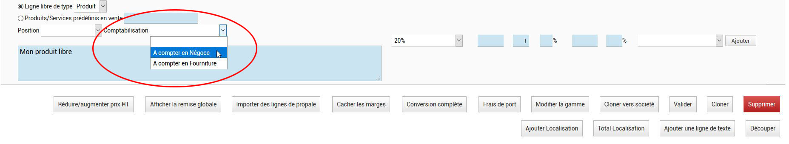
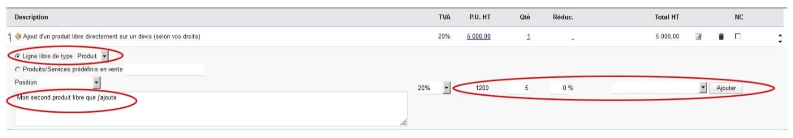
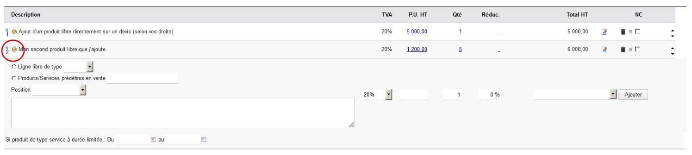
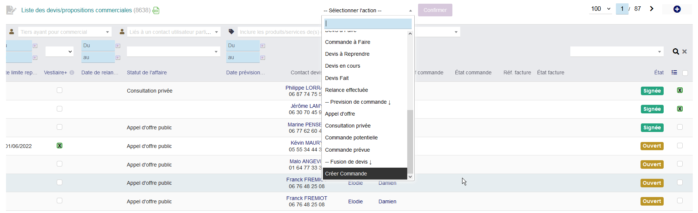

 # Devis fonctions avancées

## Propositions commerciales hors portefeuille
* Il arrive parfois qu'un commercial itinérant doivent s'occuper d'un devis d'un client, sans toutefois être le commercial affilié. Par exemple, le client Biehr ne fait pas parti des clients de Damien Haillant car il n'est pas sur son secteur. Cela dit, il peut arriver que Damien rencontre ce client, à la demande de LDM, pour traiter une affaire avec lui.
* Dans ce cas là, le client est donc "hors portefeuille". **Il ne faut pas ajouter Damien comme commercial à ce tiers car il aurait alors accès à la totalité des informations du client.**
* Il faut qu'un commercial interne de LDM, créé le devis (si ce n'est pas déjà fait) et ajoute Damien en tant que contact de "Commercial suivi proposition"  depuis l'onglet "Contact/Adresses" du devis.
* A ce moment là, le devis apparaitra dans la liste des devis hors portefeuille du commercial, accessible depuis commercial > hors portefeuille

> [! WARNINGS]
> Attention, le détail du devis hors portefeuille n'est pas accessible directement en ligne. Il faut en faire la demande aux commerciaux internes de LDM

## Récap Fourniture Pose Transport Négoce (RécapFPTN)
* Sur l'écran d'édition du devis, un module vous détaille les informations récapitulative sur le montant de la fourniture, de la pose, du transport et du négoce
* Ces informations sont automatiquement compilées à partir des catégories de produit dans lesquel le produit en question a été catalogué
* Pour ce qui concerne le négoce, il y a deux cas de figure à prendre en compte

<!-- tabs:start -->

#### ** C'est un produit référencé **

Depuis le menu horizontal haut, aller sur 'Tiers'
* Dans ce cas pas de problème.
* Si le produit a été référencé dans la catégorie décompté comme négoce, il n'y a rien à faire

#### ** C'est un produit libre **

Dans ce cas, sans précision de votre part, le produit sera compté comme fourniture
* Au moment où vous ajoutez le produit libre, vous disposez d'une liste de sélection permettant de préciser comment ce produit devra être décompté.
* En sélectionnant négoce à ce moment, le produit libre sera décompté comme tel

<!-- tabs:end -->

## Paramétrer le Récap FPTN

## Ajouter un prix de revient dans un produit libre
* Si vous disposez des droits vous permettant d'ajouter des produits libres, vous pouvez indiquer des éléments de ce type dans les devis
* Néanmoins, vous devez systématiquement indiquer un prix de revient
* Le prix de revient n'est accessible en écriture que si vous disposez des droits d'accès aux marges et si l'affichage des marges est actif sur le devis.
* Pour rendre actif l'affichage des marges, cliquer sur le bon 'afficher les marges' situé en bas de l'écran d'édition du devis.

## Ajouter un produit libre au catalogue
* Si vous disposez des droits nécessaires, vous avez la possibilité d'ajouter un produit libre à votre devis.
* Pour cela, depuis l'écran d'édition des devis, sélectionner le type de ligne : produit ou service
* Remplissez ensuite la description du produit ou du service, ainsi que le prix, le taux de tva, la quantité et si besoin, la remise
* Ajouter le produit ou le service
* Une fois le produit ou le service libre ajouté, vous voyez apparaitre à gauche du produit, sous le numéro de ligne, une icône en forme de flèche.
* En cliquant sur cette flèche, une boite modale vous permettant de personnaliser la référence du produit apparait. **Personnaliser la référence avec un intitulé logique et abrégé.**
* Valider, le produit ou le service est ajouté au catalogue et sera disponible par la suite dans les produits prédéfinis.
* Une fois le produit ajouté au catalogue, retournez sur sa fiche et indiquer son prix d'achat ainsi que son poids de façon à ne pas mettre en péril le calcul du poids du devis et celui de la marge.

## Deviser sur excel en vue d'importer sur dolibarr
* Depuis Z:\Service commercial\Devis\deviseur_xl
* Faites une copie du fichier deviseur_xl et renommer le nouveau fichier deviseur_xl_votrepremom
* Ne mettez pas d'accent, d'espace et de caractères spéciaux dans le nom du fichier
* Ouvrez votre fichier et rendez-vous dans l'onglet "parametres"
* **A continuer….**

## Importer des lignes de devis depuis excel
* Depuis la page d'édition du devis
* Cliquer sur le bouton "importer des lignes de propale"
* Sélectionner votre fichier (au format CSV ou XLS) dans le champ qui apparait
* Le format du tableau doit être le suivant : Réf. | Libellé | Qté | PU ht
* Vous pouvez générer un devis excel compatible depuis l'outil excel

## Conversion complète
* Sur l'écran d'édition du devis se trouve un bouton "conversion complète.
* Ce bouton permet de transformer en produits catalogue, tous les produits libres d'un devis.
* Cette fonction est donc à utiliser avec parcimonie, car sinon le risque est important de surcharger la base produit de cas particuliers…

## Fusionner plusieurs devis en une seule commande
* Depuis la liste des devis, sélectionner plusieurs devis d'un même tiers (obligatoire)
* Dans la liste déroulante, des actions de masse, vous pouvez choisir de créer la commande (rubrique '--Fusion de devis ↓')
* Un écran intermédiaire va vous demander de sélectionner le projet, la date et d'autres informations par rapport à ce qui est indiqué dans les devis de départ
* Ensuite la commande est créée
* Avant le détail de chaque devis, une ligne de texte est ajoutée pour rappeler la provenance des lignes
