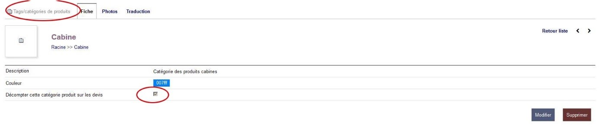
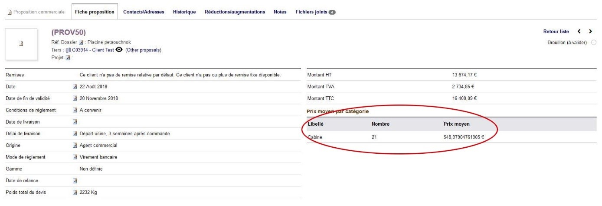

 # Fonctions avancées
 
## Personnaliser les mails préenregistrés pour l'envoi de devis, des commandes et de factures
* Si vos droits utilisateurs vous le permettent
* Aller dans accueil > configuration > Emails > Modèles des courriels
* Editer un modèle déjà existant ou ajouter un nouveau modèle.

## Formater les numéros de téléphone en base

## Archiver des devis

## Obtenir le prix moyen d'un produit par devis
* Afin d'analyser nos pratiques commerciales et de donner des indicateurs aux agents en charge des devis, il est possible de tracer le prix moyen d'un ou plusieurs produits par devis.
* Par exemple, sur l'écran d'édition des devis la table "Prix moyen par catégorie" vous indique le prix moyen des produits concernés.
* Par défaut, seul le prix moyen des cabines est tracé.
* Il est cependant possible de tracer n'importe quel produit ou groupe de produit.
* Pour cela, il suffit de vous rendre dans une catégorie de produit et de cocher la case : décomptez sur l'écran des devis
* A partir de ce moment, l'intitulé de la catégorie concerné apparait dans la table "Prix moyen par catégorie" et tous les produits qui sont présents dans cette catégorie sont décomptés si ils sont ajoutés au devis en cours.
* Pour pouvoir ajouter des produits dans une ou plusieurs catégorie, vous devez avoir les droits correspondants.

## Lier des produits associés à un produit (fonction désactivée pour le moment)
* i vos droits utilisateurs vous le permettent, vous pouvez ajouter des produits associés à un produit du catalogue.
•	Pour cela, rendez-vous sur la fiche d'un produit.
•	De là, aller dans l'onglet "Produits associés"
•	Rechercher un produit du catalogue et indiquer une quantité et si le produit est requis.
•	Vous pouvez ajouter autant de produits associés que nécessaire

