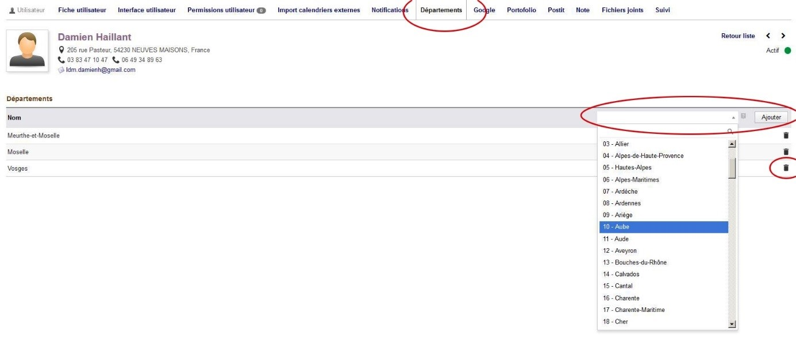

 # Tiers

## Notions de tiers

* Dolibarr parle principalement de tiers. Il est fondamental de bien comprendre ce que recouvre cette notion avant d’aller plus loin.
* Un tiers est une personne physique ou morale
* Un tiers peut être un fournisseur, un prospect, un client, ou ni l’un ni l’autre (cas d’un journaliste par exemple).
* Un tiers peut avoir plusieurs contacts. Les contacts sont des contacts physiques ou des services de l’entreprise.
* Exemple :
		** LDM Équipement est le tiers, c’est l’entité qui sera facturée
		** Il y a plusieurs contacts : Jean Deschaseaux, Véronique Lallemant, Pierre Nimsgern, Service expédition, etc…
* Dans le cas d’un client particulier, il faut créer un tiers de type « particulier » et ajouter le contact de la personne. Mais même un contact particulier doit être un tiers. 
* Exemple :
		** Julien Marchand est le tiers, c’est l’entité qui sera facturée
		** Il y a au moins un contact : Julien Marchand, la personne physique
		** Il pourrait y avoir plusieurs contacts : le contact de Madame, le nom des enfants, etc…Imaginez un abonnement à la médiathèque, une carte d’abonnement facturée à Julien Marchand, permet à Madame Marchand et à ses enfants d’emprunter également des livres.

> [!TIP]
> Bref, s’il faut retenir simplement quelque chose : **Il faut toujours qu’un contact soit relié à un tiers**

## Fusionner des tiers

Il est possible de trouver des doublons dans les tiers. Dolibarr permet de fusionner des tiers, selon vos permissions.
* Dolibarr permet de fuisionner deux doublons de tiers pour n'en conserver qu'un seul
* Rendez-vous sur la fiche d'un tiers
* Cliquez sur fusionner et choisissez dans la fenêtre d'invite le tiers avec lequel fusionner.

> [!WARNING]
> ATTENTION, la fusion se fait depuis le tiers duquel vous l'exécutez, c'est ce tiers qui sera enrichi avec les informations de l'autre tiers.

## Attribution d'un commercial à un tiers

* A la création d'un tiers, le commercial qui lui est dédié est automatiquement lié en fonction du département.
* Si vos droits vous le permettent, il est également possible d'ajouter d'autres comptes utilisateurs (commercial) à un tiers. 
* Pour cela, rendez-vous sur la fiche du tiers. De là, cliquez sur le bouton "modifier" situé à droite de "Commerciaux". De cet écran, vous pourrez ajouter autant de commerciaux que souhaité.

> [!WARNING]
> Attention toutefois, chaque commercial lié a la possibilité de voir la totalité du client, y compris les devis réalisés pour ce client par d'autres commerciaux

## Attribuer un ou plusieurs départements à un commercial

* Si vous en avez les droits, allez dans la fiche utilisateur
* Depuis cette fiche, allez dans l'onglet 'Départements'
* De là, ajouter ou supprimer des départements depuis la liste déroulante

## Créer un compte utilisateur pour un client
* Il est possible de créer un compte client pour donner un accès au client.
* Le client peut alors accéder à tous les éléments le concernant depuis le site internet www.ldmequipement.fr/portail
* Un tiers et un contact doivent être enregistré.
* Depuis la fiche du contact concerné, cliquer sur "Créer un compte utilisateur"
* Attribuer un login (prenom.nom en minuscule) et un mot de passe
* Classer l'utilisateur créé dans le groupe utilisateur "Accès portail client"
* Une fois que tout cela est fait, envoyer le mot de passe par mail à l'utilisateur depuis sa fiche utilisateur ainsi que l'adresse de connexion au portail
* C'est tout bon. Bravo !

## Ajouter l'IBAN et le BIC/SWIFT du tiers
* Si vous devez ajouter le N° IBAN du client mais que vous ne disposez pas du BIC/SWIFT, vous pouvez le trouver assez facilement depuis un vérificateur d'IBAN disponible à cette adresse → [https://fr.iban.com](https://fr.iban.com/)
* Le fait de vérifier l'IBAN permet de s'assurer que le compte existe bien

## Frais de gestion
* Des frais de gestion d'un montant de 25€ doivent être comptés pour tout devis ou commande inféreiur à 250€ ht
* Le module frais de gestion vérifiera automatiquement au moment de la validation du devis ou de la commande si les frais de gestion doivent être ajoutés
* Dans le cas où vous souhaitez offrir les frais de gestion vous pouvez les ajouter mauellement et les réduire de 100%
* Si votre client est dispensé des frais de gestion, il vous suffit de cocher la case 'Dispensé des frais de gestion' sur la fiche de votre client. Si il est dispensé des frais de gestion, les frais ne seront pas ajoutés à votre client
> [!TIP]
> Vous pouvez tout à fait ajouter les frais de gestion par vous même comme n'importe quel produit, ils ne seront pas ajoutés une seconde fois lors de la validation. Cela vous permet par exemple d'offrir les frais plus facilement
> [!WARNING]
> Les frais de gestion ne sont pas rétroactif. C'est à dire que si vous cloner une devis avec des frais de gestion vers un client exonéré de frais de gestion, les frais de gestion ne seront pas automatiquement retirés.